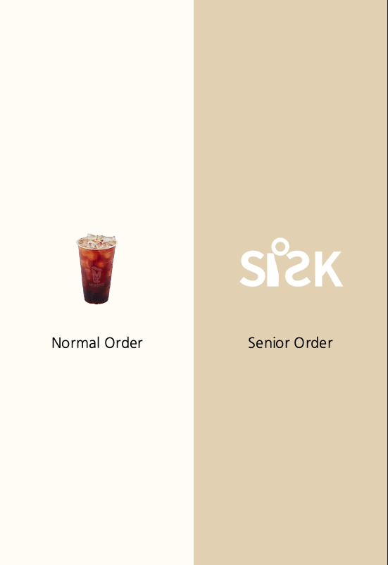
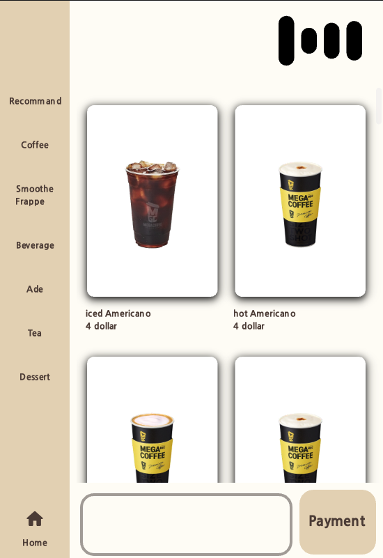
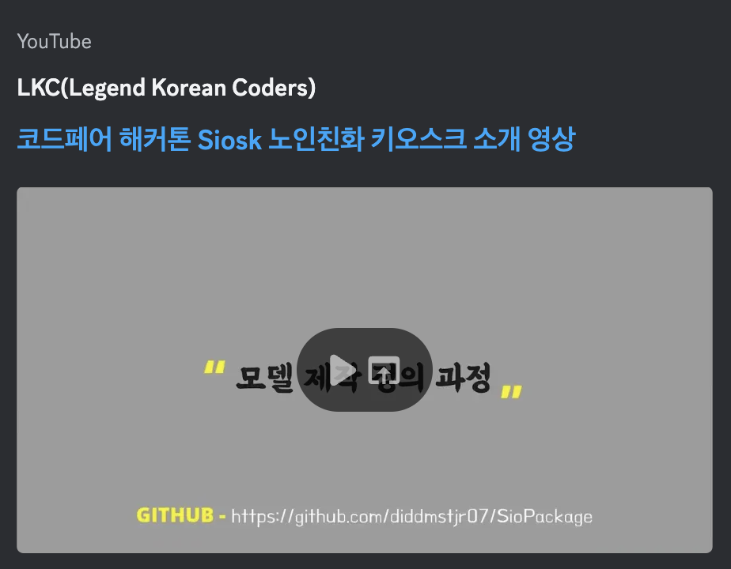

 

 클론하는 방법

    git clone --recurse-submodules https://github.com/diddmstjr07/SioPackage_en.git
 
Windows에서 실행하는 방법

    -> setup.exe 파일을 더블 클릭하세요.
    -> 로딩이 완료될 때까지 기다리세요. (!!중요!! 로딩이 완료되어도 setup.exe 창을 닫지 마세요.)
    -> main.exe 파일을 더블 클릭하세요.

 
Unix에서 실행하는 방법

    -> 터미널을 열고 다음 명령어를 입력하세요.

    -> "sh setup.sh"
    -> "sh main.sh"

  
   

 
Siosk 사용 방법

    -> setup.exe와 main.exe를 더블 클릭하면 세 개의 창이 나타납니다.

    -> 1. 키오스크 사용자 인터페이스 화면
    -> 2. 클라이언트-백엔드 콘솔 창
    -> 3. 서버-백엔드 콘솔 창

    -> 일반적인 방식으로 메뉴를 주문할 수 있습니다.
    -> main.exe 콘솔에 표시된 대로, Gemini AI 모델에게 메뉴 주문을 말할 수 있습니다.

 
예시 질문 목록

    Q. 안녕하세요 A. ~~~~
    Q. 아이스 아메리카노 주세요 A. ~~~
    Q. 하나 주세요 A. ~~~~
    Q. 차갑게 주세요 A. ~~~~
    Q. 알겠습니다 A. ~~~~
    Q. 결제할게요 A. ~~~~

 

소개 영상

    

