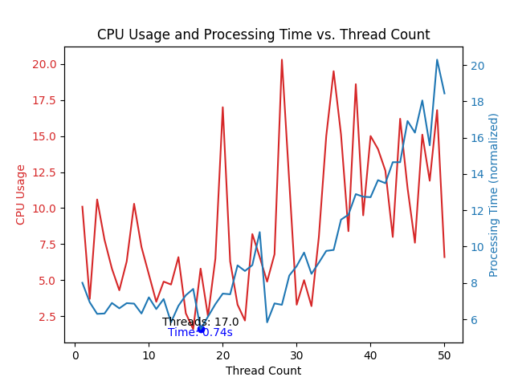

 
Finally, Using Kiosk for Seniors are opened  
Using Python AI Similarity comparing AI algorithm, kiosk interaction term speed had reduce to 0.7 secSiosk UI programming are still working 😂

If the above graph is represented as a set of 50 data points (regardless of the graph) with x as the number of analyses working in parallel as threads and y as the number of data points analyzed one by one directly, 
 it would look like {(1, 49), (2, 48), (3, 47), .... (25, 25), ....., (48, 2), (49, 1), (50, 1)}.   We actually wrote the code and plotted the CPU usage and time using matplotlib, which plots the graph in python with the y-axis of the graph above, the y-value of the set above the number of threads, and the x-axis of the graph with the x-value of the set above the number of threads used. We found that it is most efficient to set 17 threads to work simultaneously, and let the remaining 33 processes run individually. 

How to clone 

    git clone --recurse-submodules https://github.com/diddmstjr07/SioPackage.git

 
Finally, Using Kiosk for Seniors are opened  
Using Python AI Similarity comparing AI algorithm, kiosk interaction term speed had reduce to 0.7 secSiosk UI programming are still working 😂

위 그래프는 50개의 데이터를 기준으로 (그래프와 관계없이) x 값으로는 thread로 동시에 작동하는 분석의 개수, y에는 직접 하나씩 분석하는 데이터의 개수의 집합으로 나타내면, {(1, 49), (2, 48), (3, 47), …. (25, 25), ….., (48, 2), (49, 1), (50, 1)} 이와 같다. 이를 실제로 코드를 작성하여, CPU 사용량과 소요시간을 위 그래프의 y축으로, Thread의 개수 위 집합의 y 값을 설정하고 그래프의 x축의 값으로는 위의 집합의 x값으로 Thread의 사용개수로 설정하여 python의 그래프를 그려주는 matplotlib를 활용하여 그래프를 그린 결과로써, 쓰레드 17개를 설정하여 동시에 작동을 시키고, 나머지 33개의 프로세스는 각자 실행을 시키는 것이 가장 효율적임을 발견하게 되었다. 

How to clone 

    git clone --recurse-submodules https://github.com/diddmstjr07/SioPackage.git

DIRECTORY
    
    .
    ├── auto
    │   └── delete.py
    ├── Siosk
    │   ├── image
    │   │     ├── graph_epoch1.png
    │   │     ├── graph_epoch2.png
    │   │     ├── graph_epoch3.png
    │   │     ├── graph_epoch4.png
    │   │     ├── graph_epoch5.png
    │   │     └── graph_epoch6.png
    │   ├── log
    │   │     └── setup.log
    │   ├── package
    │   │     ├── anoask.py
    │   │     ├── converter.py
    │   │     ├── error_manage.py
    │   │     ├── model.py
    │   │     └── neuron.py
    │   ├── static
    │   │     ├── similarity_gen.py
    │   │     ├── similarity_thread_gen.py
    │   │     ├── similarity_thread.py
    │   │     └── static.py
    │   ├── .gitignore
    │   ├── LICENSE
    │   ├── main.py
    │   ├── requirements.txt
    │   └── README.md
    │
    ├── SioskUI
    │   ├── assets
    │   │     ├── hot_coffee.png
    │   │     ├── ice_coffee.png
    │   │     └── icon.png
    │   ├── .gitignore
    │   ├── build.py
    │   ├── main.py
    │   ├── requirements.txt
    │   └── README.md
    ├── .gitignore
    ├── .gitmodules
    ├── main.py
    ├── README.md
    ├── requirements.txt
    └── setup.py
